# Node.js App Observability Stack

A two-instance observability pipeline on AWS EC2 — metrics, logs, and container-level resource monitoring for a Node.js/Express application, built manually with Docker across both instances to understand each moving part before automating any of it.

## The problem this solves

A running app with no visibility into its own behavior is a liability — you find out about slow endpoints, error spikes, or resource exhaustion from users instead of dashboards. Bolting monitoring onto a single box also doesn't scale: the app server shouldn't be the one storing months of metrics and logs, and a monitoring stack shouldn't share resources with the thing it's watching.

This project separates the two concerns onto dedicated instances: one runs the application and lightweight exporters, the other runs the full metrics/logs storage and visualization stack, wired together over private networking only.

## How it works

1. **Both EC2 instances launch from a shared launch template** (Amazon Linux 2023) with Docker installed via user-data — identical base image, different roles.
2. **The app server** runs the Node.js/Express app instrumented with `prom-client`/`express-prom-bundle` (exposing `/metrics`) and `pino` (structured JSON logs to stdout), alongside `node-exporter` (host metrics) and `cadvisor` (per-container metrics).
3. **The observability server** runs Prometheus, Loki, and Grafana on a shared Docker network. Prometheus actively **pulls** metrics from the app server on a schedule; Loki passively **receives** logs pushed to it.
4. **Promtail runs on the app server**, auto-discovering every running Docker container via `docker_sd_configs` against the Docker socket, and pushes their logs to Loki on the observability server — no per-container config needed as new exporters get added.
5. **Security groups reference each other by security group ID**, not IP or open CIDR — Loki's log-ingestion port and every scrape target stay closed to anything except the paired instance.
6. **Grafana queries both Prometheus and Loki**, rendering combined dashboards so a metrics spike and the logs behind it show up on the same screen.

## Tech stack

- **AWS**: EC2, Launch Templates, Security Groups
- **Node.js**: Express, `prom-client`, `express-prom-bundle`, `pino`
- **Observability**: Prometheus, Loki, Grafana, Promtail, node-exporter, cAdvisor
- **Containerization**: Docker, custom Docker bridge network

## Repository structure

- [config_files](config_files/) — Prometheus, Loki, and Promtail configuration files for each EC2 role
- [config_files/monitor-ec2/prometheus/prometheus.yml](config_files/monitor-ec2/prometheus/prometheus.yml) — Prometheus scrape configuration
- [config_files/monitor-ec2/loki/loki-config.yml](config_files/monitor-ec2/loki/loki-config.yml) — Loki storage and ingestion configuration
- [config_files/node-app-ec2/promtail/promtail-config.yaml](config_files/node-app-ec2/promtail/promtail-config.yaml) — Promtail log shipping configuration
- [docs](docs/) — Architecture diagrams and screenshots used in this repository
- [docker-commands.md](docker-commands.md) — Full Docker run commands for both EC2 instances
- [README.md](README.md) — Project overview and setup guide

## Setup


---

### 1. Launch Template & User Data

Both `node-ec2` and `monitor-ec2` launch from a single reusable template (`docker-ec2-setup`) — Amazon Linux 2023, `t3.micro`, Docker installed on first boot via user-data.

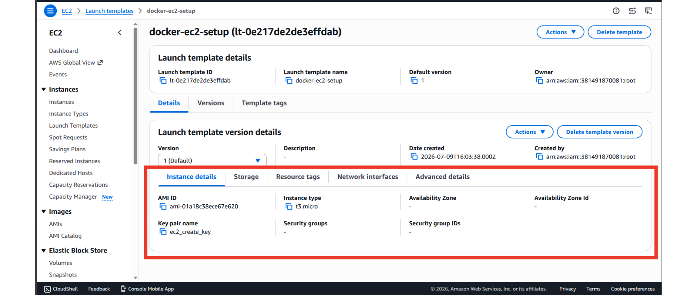

```bash
#!/bin/bash
dnf update -y
dnf install -y docker
systemctl enable docker
systemctl start docker
usermod -aG docker ec2-user
```

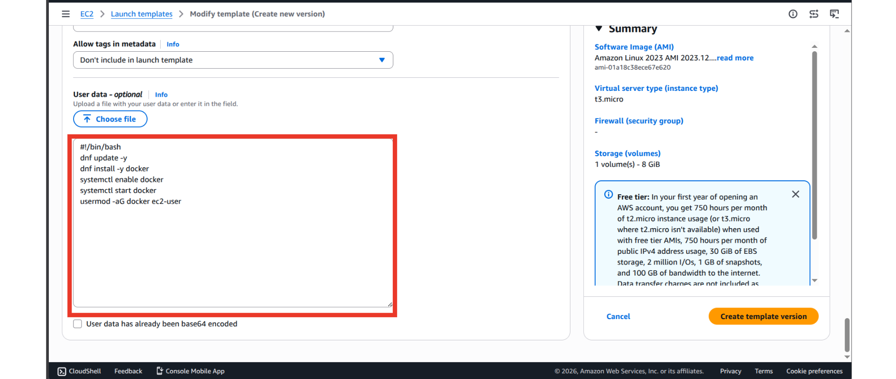

Both instances running:

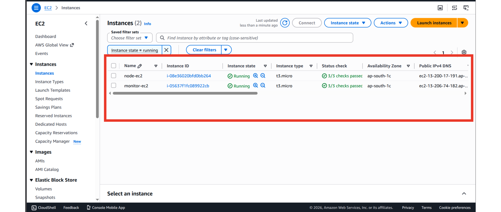

---

### 2. Security Groups — App Server (`node-ec2-sg`)

Scopes every scrape target so only the observability server can reach them.

**Inbound:**

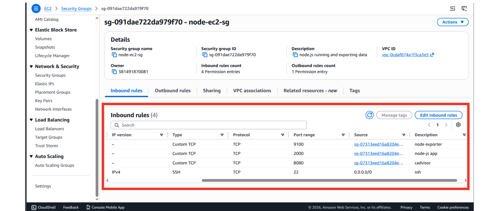

| Port | Source | Purpose |
|---|---|---|
| 22 | `0.0.0.0/0` | SSH |
| 2000 | `monitor-ec2-sg` | Node app scrape target |
| 9100 | `monitor-ec2-sg` | node-exporter scrape target |
| 8080 | `monitor-ec2-sg` | cadvisor scrape target |

**Outbound:**

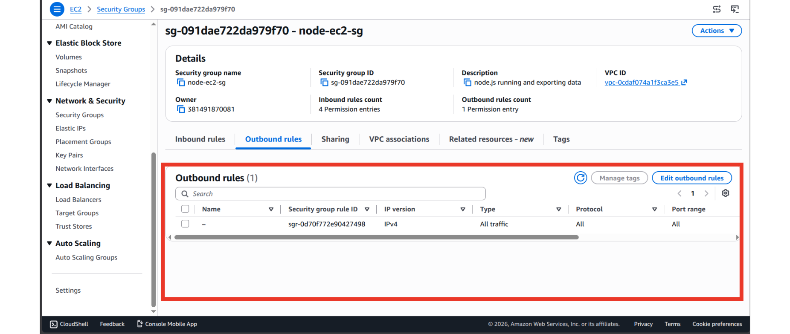

---

### 3. Security Groups — Observability Server (`monitor-ec2-sg`)

Keeps Loki's ingestion port closed to everything except the app server, while leaving the dashboards reachable.

**Inbound:**

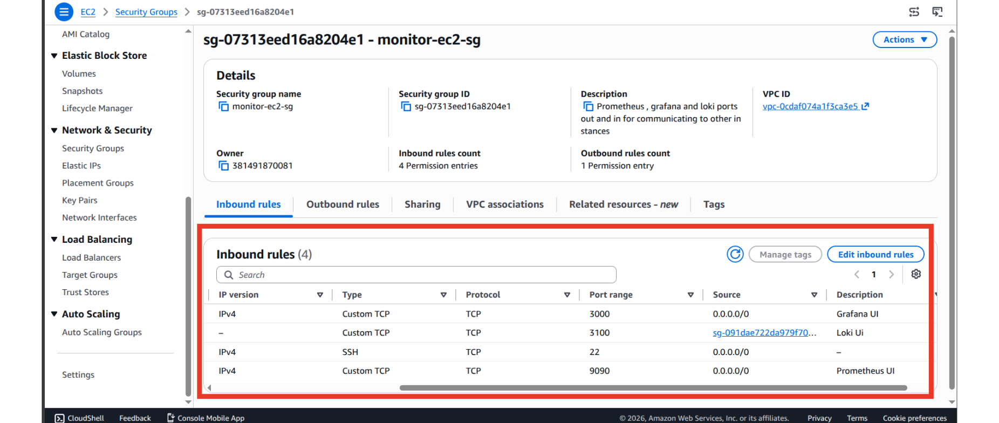

| Port | Source | Purpose |
|---|---|---|
| 22 | `0.0.0.0/0` | SSH |
| 3000 | `0.0.0.0/0` | Grafana UI |
| 9090 | `0.0.0.0/0` | Prometheus UI |
| 3100 | `node-ec2-sg` | Loki push endpoint (Promtail) |

**Outbound:**

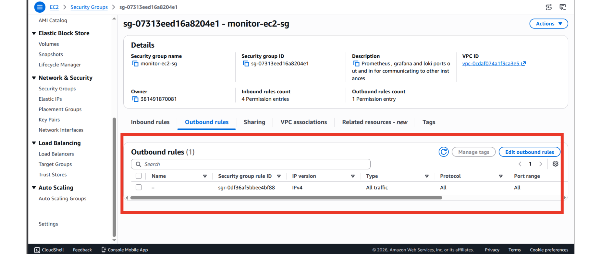

---

### 4. App Server — Directory Structure

The app-server configuration lives under [config_files/node-app-ec2](config_files/node-app-ec2/), and the main log-shipping file is [config_files/node-app-ec2/promtail/promtail-config.yaml](config_files/node-app-ec2/promtail/promtail-config.yaml).

```text
config_files/
└── node-app-ec2/
    └── promtail/
        └── promtail-config.yaml
```

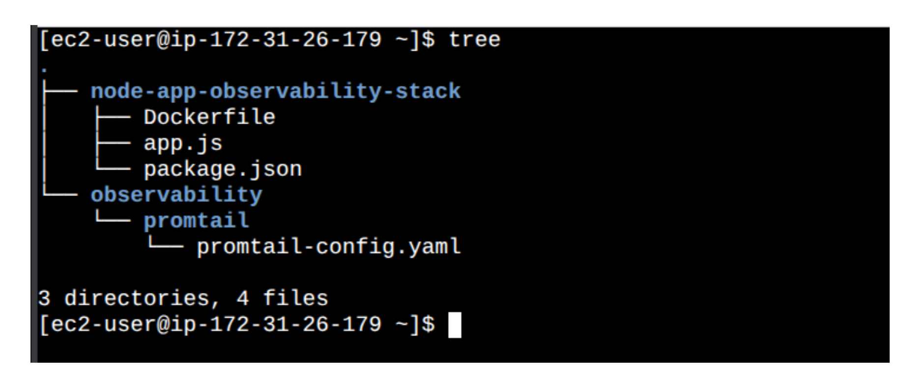

### Running the Node app

Ensure the Node.js application files (`app.js`, `package.json`, and any source files) are present in the repository root so the Docker build context includes them. Build the Docker image from the repository root and run the container:

```bash
# build the image (run from repo root)
docker build -t node-app:latest -f Dockerfile .

# run the container, exposing port 2000 for app + metrics
docker run -d --name node-app \
    -p 2000:2000 \
    --restart unless-stopped \
    node-app:latest
```

If you update the application code, rebuild and restart the container:

```bash
docker build -t node-app:latest -f Dockerfile .
docker stop node-app && docker rm node-app
docker run -d --name node-app -p 2000:2000 --restart unless-stopped node-app:latest
```

The app exposes `/metrics` on port 2000 for Prometheus scraping; ensure the security group allows traffic from the monitor instance.

---

### 5. Observability Server — Directory Structure

The observability-server configuration files are stored in [config_files/monitor-ec2](config_files/monitor-ec2/):

```text
config_files/
└── monitor-ec2/
    ├── prometheus/
    │   └── prometheus.yml
    └── loki/
        └── loki-config.yml
```

Relevant files:
- [config_files/monitor-ec2/prometheus/prometheus.yml](config_files/monitor-ec2/prometheus/prometheus.yml)
- [config_files/monitor-ec2/loki/loki-config.yml](config_files/monitor-ec2/loki/loki-config.yml)

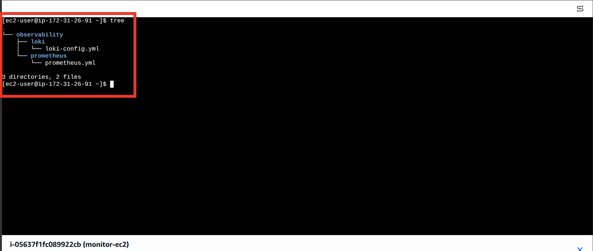

The monitoring configuration for Prometheus and Loki is maintained in [config_files/monitor-ec2](config_files/monitor-ec2/). Refer to that directory for the active scrape and storage settings used by the observability server. The IP addresses used in these configuration files are the private EC2 addresses of the instances, which keeps traffic on the internal AWS network for faster communication and lower networking cost.

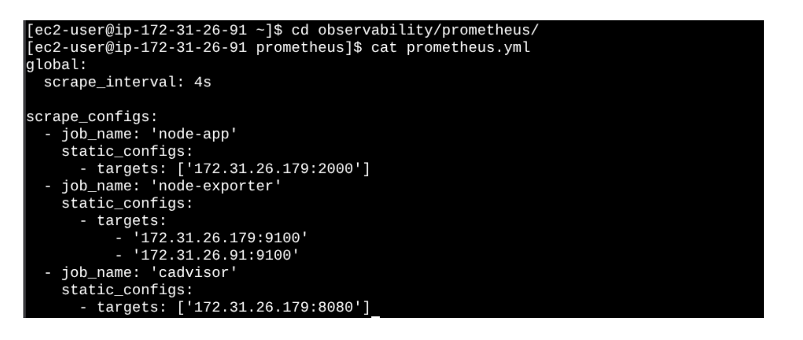

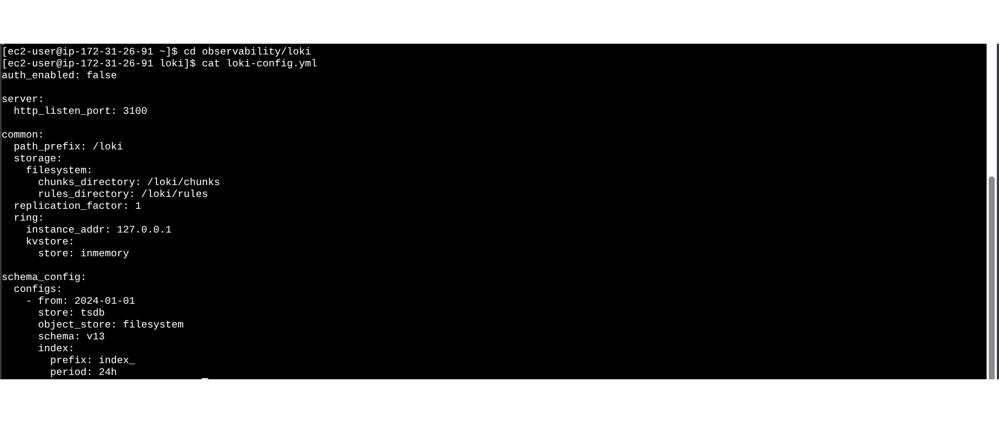

---

### 6. Promtail — Log Shipping Config

Runs on the app server, auto-discovers every container on the Docker host, and pushes their logs to Loki on the observability server.

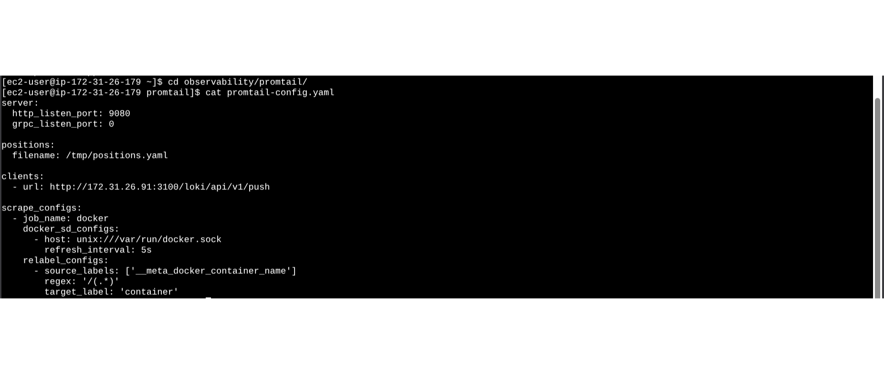

---

### 7. Verification

Containers running on `monitor-ec2`:

```bash
docker ps
```

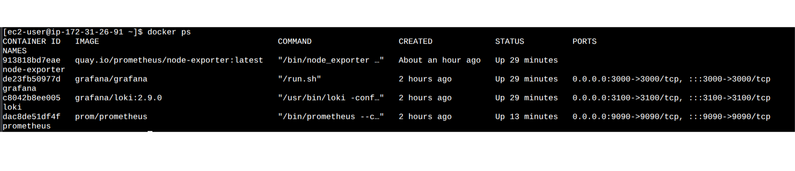

`node-exporter`, `grafana`, `loki`, and `prometheus` all up.

---

## Docker commands

Full set of `docker run` commands for both instances is documented separately in [`docker-commands.md`](docker-commands.md).

## Grafana dashboards

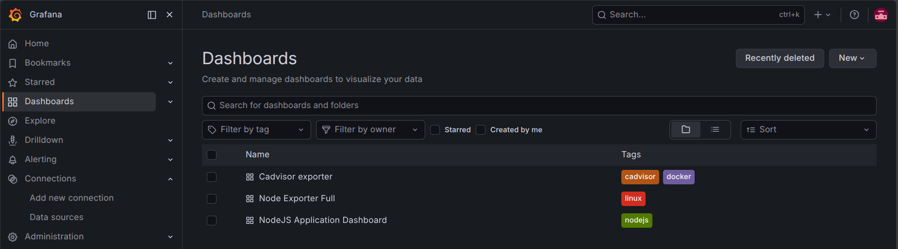

| Dashboard | Source ID | Data source | Covers |
|---|---|---|---|
| Node.js Application Dashboard | `11159` | Prometheus | Request rate, latency, status codes, event loop lag |
| Node Exporter Full | `1860` | Prometheus | Host CPU, memory, disk, network, load average |
| cAdvisor Exporter | `14282` | Prometheus | Per-container CPU%, memory, network, disk I/O |
| Live logs (custom panel) | — | Loki | `{container="node-app"}` |
| Log volume (custom panel) | — | Loki | `sum(count_over_time({container="node-app"}[1m]))` |

## Port reference

| Instance | Container | Port | Purpose |
|---|---|---|---|
| `node-ec2` | node-app | 2000 | App + `/metrics` |
| `node-ec2` | node-exporter | 9100 | Host metrics |
| `node-ec2` | cadvisor | 8080 | Per-container metrics |
| `node-ec2` | promtail | — | Log shipping (outbound only) |
| `monitor-ec2` | prometheus | 9090 | Metrics scraping + UI |
| `monitor-ec2` | loki | 3100 | Log ingestion |
| `monitor-ec2` | grafana | 3000 | Dashboards |
| `monitor-ec2` | node-exporter | 9100 | Host metrics |

## Notable engineering decisions

- **Docker for every component, including the observability stack itself**: keeps `node-ec2` and `monitor-ec2` reproducible from the same base AMI/user-data, with all app-specific setup happening at the container level, not the OS level.
- **Security groups referencing each other by SG ID, not CIDR or IP**: keeps rules valid across relaunches (private IPs can change) and keeps internal-only ports like Loki's ingestion endpoint closed to the public internet entirely.
- **Prometheus pulls, Promtail pushes**: this asymmetry decided which side's config needed the other instance's IP — Prometheus is configured with the app server's address, Promtail with the observability server's.
- **`docker_sd_configs` over static per-container Promtail scrape configs**: new containers on the app server (exporters, future services) are picked up automatically without touching Promtail's config.
